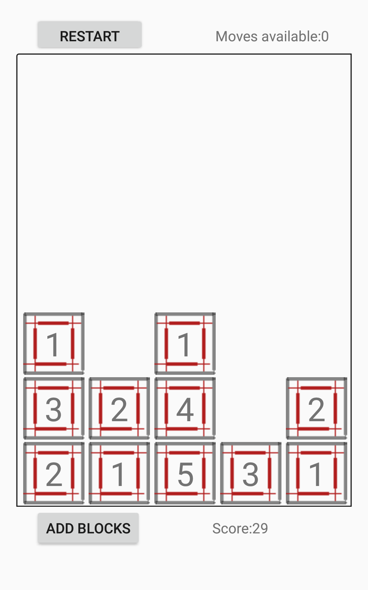

# Block 1 To 9

A grid-based number-merging puzzle for Android. Tap two adjacent blocks with the same value to merge them into a higher one. New rows push in from the bottom — keep any column from filling up.

> **Built in 2018, archived as-is.** A full **Kotlin rewrite is in progress** and will be published on Google Play as a closed-source release. This Java prototype stays public as the heritage snapshot — see [*Roadmap*](#roadmap) below.

<p align="center">
  
</p>

---

## How it plays

- A **5 × 7 grid**, starting empty. Tapping **Add blocks** pushes a new row of numbered blocks (values 1–3) up from the bottom.
- **Merge rule**: select two adjacent blocks (horizontal or vertical) with the *same* value — they merge into a single block with `value + 1`. Score increases by the merged value.
- Every 5 moves, a new row is added automatically. **A column that reaches the top ends the game.**
- **Special-move twist** — when a block reaches **10** it disappears and grants **5 special moves**. During these, diagonal merges are also allowed, opening up combos that aren't normally possible.

The design pressure is real: you have to keep the board low and short-term productive, while the special-move counter rewards setting up long chains.

---

## At a glance

| | |
|---|---|
| Language | Java |
| Platform | Android (single Activity for the game + Splash/Rules entry) |
| Grid | 5 columns × 7 rows, `Integer[][]` matrix |
| Persistence (planned) | Room — `Game` is already a `@Entity` |
| Settings UI | Stock Android `PreferenceActivity` scaffolding |
| Status | **Prototype** — playable core loop, stubs for save / score persistence |

---

## Code highlights

The engine is small but the separation is decent for a prototype:

- **`Match`** — pure game engine. Owns the `Integer[][] matrix`, the score, the move counters, and the special-move state. Exposes `addRow()`, `makeTheMove()`, `checkAvailableMoves()`, `checkTheFirstMove()`. No Android types in its core logic *except* where it instantiates `Block` views — that coupling is something the rewrite will fix (see Roadmap).
- **`checkAvailableMoves()`** — walks the matrix counting valid merges in three directions: down, right, and diagonal (only while special moves are active). Same predicate powers the "Moves available" HUD and the "no moves left → game over check".
- **`checkTheFirstMove()`** — returns the coordinates of the first legal merge it can find. The skeleton for a future *hint* feature.
- **`Block extends AppCompatTextView`** — the on-screen block *is* a `TextView` with a background drawable and three extra fields (`row`, `column`, `value`). Small, but it ties the model to the view. The Kotlin rewrite separates these.
- **`Game` (Room `@Entity`)** — table `games` with `blocksPlayed`, `movesDone`, `score`. The schema is there; the `saveTheGame()` and `saveTheScore()` methods are stubs — finishing them is part of the Roadmap.

---

## Project layout

```
app/src/main/
├── AndroidManifest.xml
├── java/com/taiuti/block1to9/
│   ├── MainActivity.java               # Splash + rules screen
│   ├── Block1to9Activity.java          # Game screen
│   ├── core/
│   │   └── Block1To9.java              # Application class
│   └── model/
│       ├── Match.java                  # Game engine (matrix, moves, score)
│       ├── Block.java                  # TextView-based on-screen piece
│       └── Game.java                   # Room @Entity for stats
└── res/
    ├── layout/                         # activity layouts
    ├── drawable/                       # block sprites, borders
    └── values/                         # strings, colors, dimens, styles
```

---

## Roadmap

The path forward for this project is **not** patching the Java code — it's a full **Kotlin rewrite published on Google Play**. The plan, in order:

1. **Kotlin rewrite** — same gameplay, modern Android stack:

   | Concern | 2018 (Java, this repo) | Target (Kotlin, private repo) |
   |---|---|---|
   | Language | Java | **Kotlin** |
   | UI | XML layouts + custom `TextView` blocks | **Jetpack Compose** |
   | Engine ↔ View coupling | `Block extends AppCompatTextView` | pure data class + composable that renders it |
   | State | mutable fields on `Match` | `StateFlow` + immutable game state |
   | Persistence | Room entity with stub save methods | **Room** + repository, async via coroutines |
   | DI | none | **Hilt** |
   | Support libs | `android.support.v7`, `android.arch.*` | **AndroidX** |
   | Build | (no Gradle files committed in this snapshot) | Kotlin DSL `build.gradle.kts`, version catalogs |

2. **Polish for store release** — sound, animations on merges, a real score history screen, basic accessibility (TalkBack labels, large-text scaling).

3. **Monetization** — Google **Play Billing** integration: a small set of cosmetic / utility IAPs (e.g. theme packs, hint pack, remove-ads). Implementation will respect server-side purchase validation; no secrets land in the client.

4. **Closed-source release** — the Play Store version ships from a private repo. Reason: once a paid product is involved, an open Java/Kotlin source is an invitation to "free fork" republished on alternative stores. This public repo stays as the *heritage* snapshot — the "where it started" — and will get a `→ Live on Google Play: <link>` once the new version ships.

The goal is to take the 2018 prototype, the special-move mechanic that I'm proud of, and ship a real product around it.

---

## Build & run

This 2018 snapshot is **partial on purpose** — it preserves the source as it was when I stopped working on it. The repository **does not include** the `AndroidManifest.xml`, the Gradle build files (`build.gradle`, `settings.gradle`, `gradle/`), or any signing config. To make it runnable today you'd need to:

1. Wrap the `app/` source as a module in a fresh Android Studio project.
2. Recreate the `AndroidManifest.xml` (declaring `MainActivity` and `Block1to9Activity`, the `CAMERA` permission isn't needed here, just the standard launcher entry).
3. Migrate the `android.support.v7` and `android.arch.persistence.room` imports to **AndroidX** (Android Studio's *Refactor → Migrate to AndroidX…* does most of it).
4. Provide a top-level Gradle setup targeting a recent Android Gradle Plugin.

The code is here for reading more than running — the runnable version is the upcoming Kotlin rewrite (see [*Roadmap*](#roadmap) above).

---

## Credits

- **Filippo Taiuti** — design and implementation.

Block design and "merge to next number" lineage owe a debt to the genre established by *2048* and *Drop7*; the special-move / diagonal-unlock mechanic is original to this project.
